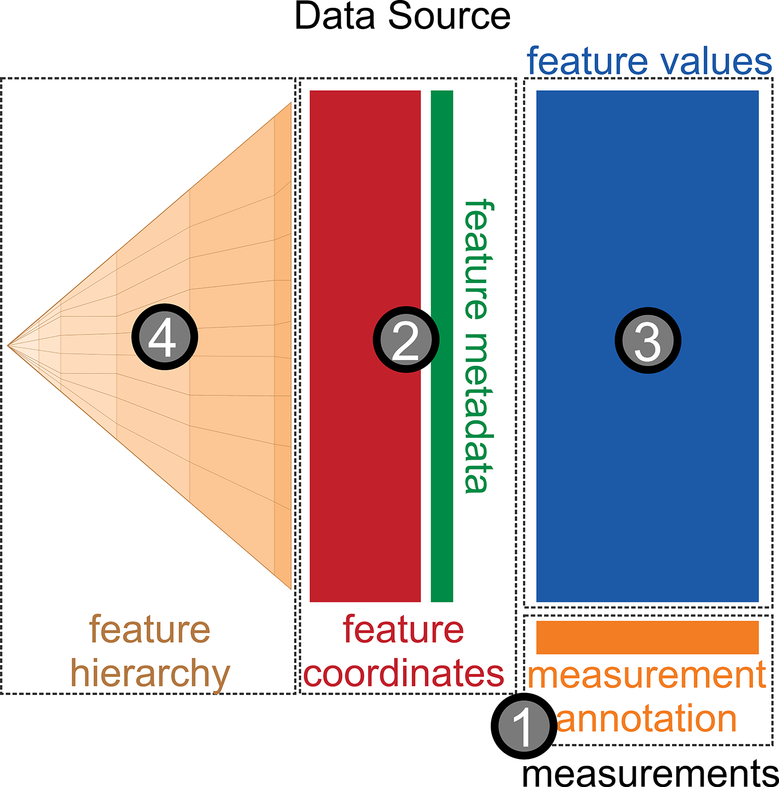
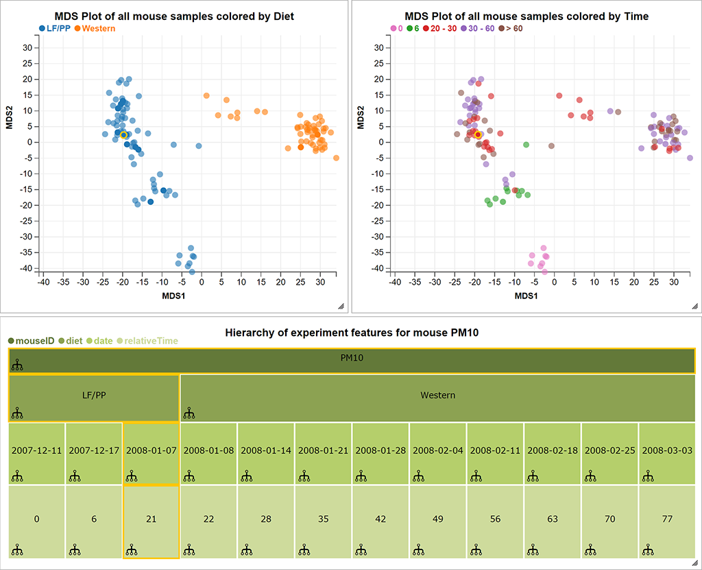

## Our motivation

Measuring DNA methylation and understanding role in expression regulation in solid tumors

<div class="centered">

</div>

Large blocks of *hypo-methylation* (sometimes Mbps long) in colon cancer

<footer class="source">
Hansen, et al., *Nat. Genetics*, 2011<br>
Corrada Bravo, et al., *BMC Bioinformatics*, 2012<br>
Timp, et al., *Genome Medicine*, 2014<br>
Dinalankara, et al., *Cancer Informatics*, 2015<br>
</footer>

---

## Our motivation

Measuring DNA methylation and understanding role in expression regulation in solid tumors
<div class="centered">

</div>

*Hyper-variable* genes are enriched within these blocks.

<footer class="source">
Hansen, et al., *Nat. Genetics*, 2011<br>
Corrada Bravo, et al., *BMC Bioinformatics*, 2012<br>
Timp, et al., *Genome Medicine*, 2014<br>
Dinalankara, et al., *Cancer Informatics*, 2015<br>
</footer>

---

## Our motivation

Measuring DNA methylation and understanding role in expression regulation in solid tumors
<div class="centered">


</div>

*Consistently hyper-variable* genes are tissue-specific.

<footer class="source">
Hansen, et al., *Nat. Genetics*, 2011<br>
Corrada Bravo, et al., *BMC Bioinformatics*, 2012<br>
Timp, et al., *Genome Medicine*, 2014<br>
Dinalankara, et al., *Cancer Informatics*, 2015<br>
</footer>

---

## R/Bioconductor

<div class="centered">

</div>

- State-of-the-art computational and statistical analysis
platform
- We develop and apply methods for these analyses in this platform
- Our collaborators perform analysis in this platform

---

## What we wanted

> - Data transformation and modeling: data smoothing, region finding (R/Bioconductor: `Bsmooth`, `minfi`)
> - Genome browsing: search by gene, search by overlap
> - Region analysis: overlap with other data (our own, other labs, UCSC, ensembl)
> - Regulation: expression data (Gene Expression Barcode)

--- 

## Analysis era 

- *We have unprecedented ability to measure*
- *and lots of publicly available data to contextualize it*

<div class="centered">


<footer class="source">[H. Wickham]</footer>
</div>

---

<div class="centered">

</div>

### Integrative, visual and computational exploratory analysis of genomic data

- Browser-based
- Interactive
- Data integration from multiple sources
- Reproducible dissemination
- Communication with R/Bioc: `epivizr` package

> **I want to use a genome browser track as a display device in R!!**

<footer class="source">[Nat. Methods, 2014]</footer>

---

## 

Plug-in data from R with `epivizr` package

<div class="centered">
<video width="80%" height="80%" controls>
  <source src="movies/load_epivizr.mp4" type="video/mp4">
Your browser does not support the video tag.
</video>
</div>

---

## 

Workspaces and filtering

<div class="centered">
<video width="80%" height="80%" controls>
  <source src="movies/login_filter.mp4" type="video/mp4">
Your browser does not support the video tag.
</video>
</div>

---

## 

Data transformations and customization

<div class="centered">
<video width="80%" height="80%" controls>
  <source src="movies/transform_customize_v2.mp4" type="video/mp4">
Your browser does not support the video tag.
</video>
</div>

---

## 

More transformations and aggregation

<div class="centered">
<video width="80%" height="80%" controls>
  <source src="movies/transform_aggregate.mp4" type="video/mp4">
Your browser does not support the video tag.
</video>
</div>

---

## 

Add new visualizations

<div class="centered">
<video width="80%" height="80%" controls>
  <source src="movies/extend_customize.mp4" type="video/mp4">
Your browser does not support the video tag.
</video>
</div>

---

## Communication with R/Bioc

Using the `epivizr` package

- Setup up an `epivizr` session

```r
mgr <- startEpiviz(workspace="qyOTB6vVnff")
```

- Calculate a statistic of interest

```r
# Get tumor methylation base-pair data
m <- assay(se)[,"tumor"]

# Compute regions with highest variability across cpgs
region_stat <- calcWindowStat(m, step=25, window=80, stat=rowSds)
s <- region_stat[,"stat"]
```
--- 

## Communication with R/Bioc

Using the `epivizr` package: browse by regions of interest.

- What's around the regions with highest across CpG variability

```r
# get locations in decreasing order
o <- order(s, decreasing=TRUE)
indices <- region_stat[o, "indices"]
slideShowRegions <- rowRanges(se)[indices] + 1250000L
mgr$slideshow(slideShowRegions)
```

> `epivizr` uses WebSockets for connection, same as `shiny`. Big, big, big
> thanks to the @rstudio folks for working on this infrastructure.

---

## 

Statistically informed visual exploration

<div class="centered">
<video width="80%" height="80%" controls>
  <source src="movies/guided_exploration_v2.mp4" type="video/mp4">
Your browser does not support the video tag.
</video>
</div>

---

## Build your own browser 

- Standalone version (JS code bundled in `epivizr` BioC package)
- Browse your favorite genome:

```r
library(epivizr)
library(Mus.musculus)

mgr <- startStandalone(geneInfo=Mus.musculus, geneInfoName="mm10",
    				      keepSeqlevels=paste0("chr",c(1:19,"X","Y")))
```

---

## Extensible framework

<iframe data-src="http://epiviz.github.io"></iframe>

---

<iframe data-src="http://epiviz.cbcb.umd.edu/?ws=WtbTU7OGMFu" width="99%"></iframe>

---

## What are we working on?

> - EpivizWidgets: using epiviz visualizations within, e.g., Rmarkdown
> - VisualCollaboration: collaborative annotation of workspaces, datasets, visualizations, etc.

---

## Beyond genomics and epigenomics: metagenomics

<div class="centered">

</div>

<footer class="source">[Human Microbiome Project]</footer>

---

## Beyond genomics and epigenomics: metagenomics

**Coordinates**:

<div class="centered">

</div>

---

## Beyond genomics and epigenomics: metagenomics

**Samples**:
<div class="centered">

</div>

---

## Beyond genomics and epigenomics: metagenomics

<div class="centered">

</div>

Hierachically organized features

---

## Beyond epigenomics: metagenomics

<div class="centered">
<video width="75%" height="75%" controls>
  <source src="movies/metavizr1.mp4" type="video/mp4">
Your browser does not support the video tag.
</video>

</div>

---

## Beyond epigenomics: metagenomics

<div class="centered">
<video width="75%" height="75%" controls>
  <source src="movies/metavizr2.mp4" type="video/mp4">
Your browser does not support the video tag.
</video>

</div>

---

## Beyond epigenomics: metagenomics

<div class="centered">

</div>

Built with `epivizr` and `metagenomeSeq`

---

## Analysis era

<div class="centered">


<footer class="source">[H. Wickham]</footer>
</div>

One interpretation of *Big Data* is *Many relevant sources of contextual data*

- Easily access/integrate *contextual* data
- Driven by exploratory analysis of *immediate* data

---

## Analysis era

<div class="centered">


<footer class="source">[H. Wickham]</footer>
</div>

One interpretation of *Big Data* is *Many relevant sources of contextual data*

- Iterative process
- Visual and computational exploration go hand in hand

---

## Creativity in exploration

We are building a software system to support creative exploratory analysis of epigenome-wide datasets...

<div class="centered">

<footer class="source">[T. Speed]</footer>

---

## Acknowledgements


Florin Chelaru, UMD

- CBCB@UMD
- JHU/Harvard: K. Hansen, W. Timp, R. Irizarry, A. Feinberg
- Genentech: Michael Lawrence
- Rstudio: Joe Cheng, et al.
- Funding: NIH, Genentech

---

## Check it out:

- Homepage: http://epiviz.github.io
- Webapp: http://epiviz.cbcb.umd.edu
- Code: http://github.com/epiviz

Nature Methods 2014    
Follow us: `@epiviz`

These slides available: http://hcorrada.github.io/ismb2015  
Me: `@hcorrada`, `hcorrada@umiacs.umd.edu`  
[`www.cbcb.umd.edu/~hcorrada`](http://www.cbcb.umd.edu/~hcorrada)


