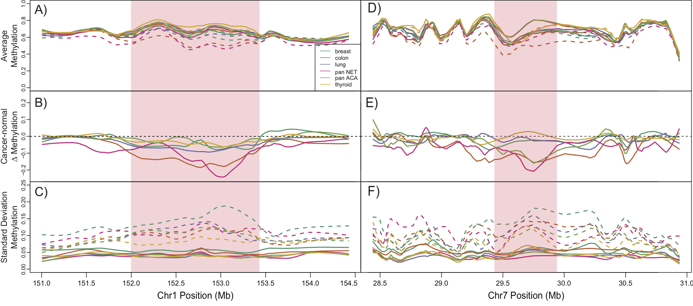
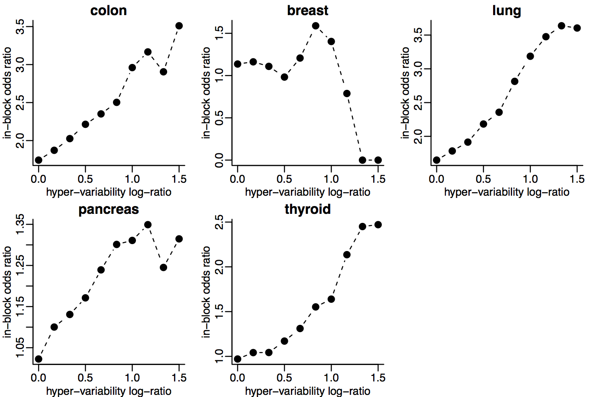
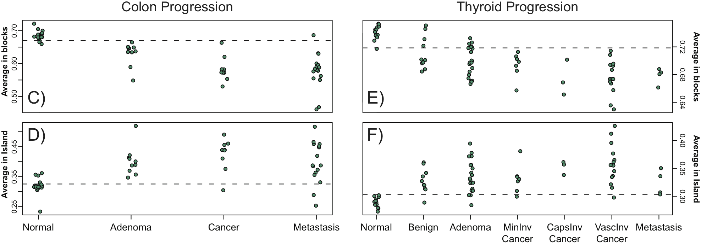

## Our motivation

Measuring DNA methylation and understanding role in expression regulation in solid tumors

<div class="centered">

</div>

Large blocks of *hypo-methylation* (sometimes Mbps long) in colon cancer

- **Hansen, et al., *Nat. Genetics*, 2011**
- Corrada Bravo, et al., *BMC Bioinformatics*, 2012
- Timp, et al., *Genome Medicine*, 2014

---

## Our motivation

Measuring DNA methylation and understanding role in expression regulation in solid tumors
<div class="centered">

</div>

Genes with *hyper-variable* expression in colon cancer are enriched within these blocks.

- **Hansen, et al., *Nat. Genetics*, 2011**
- Corrada Bravo, et al., *BMC Bioinformatics*, 2012
- Timp, et al., *Genome Medicine*, 2014

---

## Our motivation

Measuring DNA methylation and understanding role in expression regulation in solid tumors
<div class="centered">


</div>

Genes with *consistent hyper-variable expression* across tumors are tissue-specific.

- Hansen, et al., *Nat. Genetics*, 2011
- **Corrada Bravo, et al., *BMC Bioinformatics*, 2012**
- Timp, et al., *Genome Medicine*, 2014

---

## Our motivation

Measuring DNA methylation and understanding role in expression regulation in solid tumors
<div class="centered">

</div>

Consistent hyper-variability can be used as stable signatures.

- Hansen, et al., *Nat. Genetics*, 2011
- **Corrada Bravo, et al., *BMC Bioinformatics*, 2012**
- Timp, et al., *Genome Medicine*, 2014

---

## Our motivation

Measuring DNA methylation and understanding role in expression regulation in solid tumors
<div class="centered">

</div>

Degree of expression deviation from normality in specific genes can be used as prognostic tool.

- Hansen, et al., *Nat. Genetics*, 2011
- Corrada Bravo, et al., *BMC Bioinformatics*, 2012
- **Dinalankara and Corrada Bravo, *Cancer Informatics*, in press**
- Timp, et al., *Genome Medicine*, 2014

---
## Our motivation

Measuring DNA methylation and understanding role in expression regulation in solid tumors
<div class="centered">

</div>

Blocks can be detected using Illumina HumanMethylation450k bead arrays.

- Hansen, et al., *Nat. Genetics*, 2011
- Corrada Bravo, et al., *BMC Bioinformatics*, 2012
- **Timp, et al., *Genome Medicine*, 2014**

---

## Our motivation

Measuring DNA methylation and understanding role in expression regulation in solid tumors
<div class="centered">

</div>

Hypo-methylation blocks occur in all tumor types. Some universal, many cancer-specific

- Hansen, et al., *Nat. Genetics*, 2011
- Corrada Bravo, et al., *BMC Bioinformatics*, 2012
- **Timp, et al., *Genome Medicine*, 2014**

## Our motivation

Measuring DNA methylation and understanding role in expression regulation in solid tumors
<div class="centered">

</div>

Gene expression *hyper-variability* is enriched within *hypo-methylation* blocks

- Hansen, et al., *Nat. Genetics*, 2011
- Corrada Bravo, et al., *BMC Bioinformatics*, 2012
- **Timp, et al., *Genome Medicine*, 2014**

---

## Our motivation

Measuring DNA methylation and understanding role in expression regulation in solid tumors
<div class="centered">

</div>

Degree of hypo-methylation increases through cancer progression in blocks.

- Hansen, et al., *Nat. Genetics*, 2011
- Corrada Bravo, et al., *BMC Bioinformatics*, 2012
- **Timp, et al., *Genome Medicine*, 2014**

---

## Summary

- Large regions of hypo-methylation seems to be consistent in cancer
  - occur in pre-cancerous lesions
  - hypo-methylation increases with cancer progression
- Gene expression hyper-variability enriched within these regions
  - tissue-specific genes enriched within these regions
  - can use degree of deviation from normality as stable diagnosis and prognosis mark in multiple cancer types


---

## R/Bioconductor

<div class="centered">

</div>

- State-of-the-art computational and statistical analysis
platform
- We develop and apply methods for these analyses in this platform
- Our collaborators take part in analysis in this platform

---

## What we wanted

> - Data transformation and modeling: data smoothing, region finding (R/Bioconductor: `Bsmooth`, `minfi`)
> - Genome browsing: search by gene, search by overlap
> - Region analysis: overlap with other data (our own, other labs, UCSC, ensembl)
> - Regulation: expression data (Gene Expression Barcode)

--- 

## Analysis era 

> - Funding agencies calling for proposals to (strictly) *analyze* project data
>  - Epigenomics roadmap, Encode, TCGA, ...
> - Journals calling for (strictly) *analysis* papers (e.g., Nature Methods)
> - *We have unprecedented ability to measure*
> - *and lots of publicly available data to contextualize it*

--- 

## Analysis era 

- Funding agencies calling for proposals to (strictly) *analyze* project data
- Epigenomics roadmap, Encode, TCGA, ...
- Journals calling for (strictly) *analysis* papers (e.g., Nature Methods)
- *We have unprecedented ability to measure*
- *and lots of publicly available data to contextualize it*

<div class="centered">


<footer class="source">[H. Wickham]</footer>
</div>

---

<div class="centered">

</div>

### Integrative, visual and computational exploratory analysis of genomic data

- Browser-based
- Interactive
- Integration of data
- Reproducible dissemination
- Communication with R/Bioc: `epivizr` package

> **I want to use a genome browser track as a display device in R!!**

e.g.: http://epiviz.cbcb.umd.edu/2?ws=45KBV4C7z3u
<footer class="source">[Nat. Methods, 2014]</footer>

---

<iframe data-src="http://epiviz.cbcb.umd.edu/2/?ws=W3ieGz19icm" width="99%"></iframe>

---

## Communication with R/Bioc

Using the `epivizr` package

- Setup up an `epivizr` session

```r
mgr <- startEpiviz(workspace="qyOTB6vVnff")
```

- Add a device with `GRanges` data

```r
blocks_dev <- mgr$addDevice(colon_blocks, "450k blocks")
```

- Subset ranges by width

```r
keep <- width(colon_blocks) > 250000
mgr$updateDevice(blocks_dev, colon_blocks[keep,])
```

--- 

## Communication with R/Bioc

Using the `epivizr` package: browse by regions of interest.

- What's around the widest blocks?

```r
o <- order(-width(colon_blocks))
slideShowRegions <- colon_blocks[o[1:5],]
slideShowRegions <- slideShowRegions + 1e5
mgr$slideshow(slideShowRegions)
```

> `epivizr` uses WebSockets for connection, same as `shiny`. Big, big, big
> thanks to the @rstudio folks for working on this infrastructure.

---

## Plugins, plugins, plugins

Our architecture is *dynamically extensible*. We can easily integrate new data types and add new visualizations.

Example: adding a new visualization

see: https://gist.github.com/11017650

---

http://epiviz.cbcb.umd.edu/?gist[]=11017650&ws=Y8kWxCO2Ajn
<iframe data-src="http://epiviz.cbcb.umd.edu/2/?gist[]=11017650&ws=Y8kWxCO2Ajn"></iframe>

---
## Plugins, plugins, plugins

Example: import data from UCSC browser

see: https://gist.github.com/c41a2df3671395d8e4ad

---

http://epiviz.cbcb.umd.edu/?ws=cX1PgToUQs&seqName=chr11&start=59463945&end=60638081&gist[]=c41a2df3671395d8e4ad&settings=default&
<iframe data-src="http://epiviz.cbcb.umd.edu/2/?ws=cX1PgToUQs&seqName=chr11&start=59463945&end=60638081&gist[]=c41a2df3671395d8e4ad&settings=default&"></iframe>

---

## Plugins, plugins, plugins

<iframe data-src="http://epiviz.github.io"></iframe>

---

# Datatypes

<div class="centered">

</div>

- Based on "three-table" design
- Scripts can define coordinate space

---

http://epiviz.cbcb.umd.edu/?ws=SRHZlWRRAPd&gist[]=a82a998817564ce3fe48&settings=default&
<iframe data-src="http://epiviz.cbcb.umd.edu/2/?ws=SRHZlWRRAPd&gist[]=a82a998817564ce3fe48&settings=default&"></iframe>

--- 

## Build your own browser 

- Standalone version (no internet required, javascript code provided in `epivizr`)
- Browse your favorite genome:

```r
library(epivizr)
library(Mus.musculus)

mgr <- startStandalone(geneInfo=Mus.musculus, geneInfoName="mm10",
    				      keepSeqlevels=paste0("chr",c(1:19,"X","Y")))
```

---

## Analysis era

<div class="centered">


<footer class="source">[H. Wickham]</footer>
</div>

One interpretation of *Big Data* is *Many relevant sources of contextual data*

- Easily access/integrate *contextual* data
- Driven by exploratory analysis of *immediate* data
- Iterative process
- Visual and computational exploration go hand in hand

---

## Creativity in exploration

We are building a software system to support creative exploratory analysis of epigenome-wide datasets...

<div class="centered">

<footer class="source">[T. Speed]</footer>

---

## Visualization goals

- Context 
  - Integrate and align multiple data sources; navigate; search
  - *Connect*: brushing
  - *Encode*: map visualization properties to data on the fly
  - *Reconfigure*: multiple views of the same data

<footer class="source">[Perer & Shneiderman]</footer>

---

## Visualization goals

- Data
  - *Select and filter*: tight-knit integration with R/Bioconductor; 
  - (future) filters on visualization propagate to data environment
- Model
    - New 'measurements' the result of modeling; perhaps suggested by data context

<footer class="source">[Perer & Shneiderman]</footer>

---

## Check it out:

- http://epiviz.github.io
- http://epiviz.cbcb.umd.edu
- http://github.com/epiviz

Nature Methods 2014    
Follow us: @epiviz  

These slides available: http://hcorrada.github.io/tricon2015

---

## Acknowledgements


Florin Chelaru, UMD

- CBCB@UMD
- JHU/Harvard: Kasper Hansen, Winston Timp, Rafael Irizarry, Andy Feinberg
- Genentech: Michael Lawrence
- Rstudio: Joe Cheng, et al.
- Funding: NIH, Genentech


