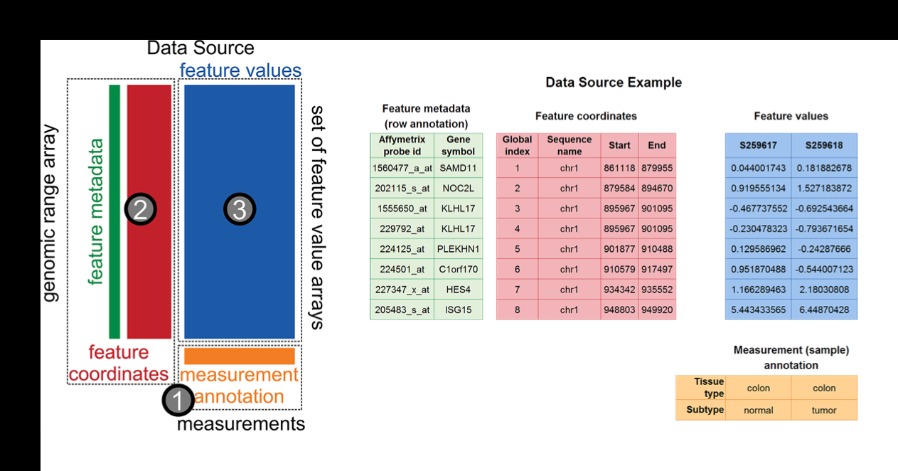

## Our motivation

Measuring DNA methylation and understanding role in expression regulation in solid tumors

<div class="centered">

</div>

Large blocks of *hypo-methylation* (sometimes Mbps long) in colon cancer

<footer class="source">
Hansen, et al., *Nat. Genetics*, 2011<br>
Corrada Bravo, et al., *BMC Bioinformatics*, 2012<br>
Timp, et al., *Genome Medicine*, 2014<br>
Dinalankara, et al., *Cancer Informatics*, 2015<br>
</footer>

---

## Our motivation

Measuring DNA methylation and understanding role in expression regulation in solid tumors
<div class="centered">

</div>

*Hyper-variable* genes are enriched within these blocks.

<footer class="source">
Hansen, et al., *Nat. Genetics*, 2011<br>
Corrada Bravo, et al., *BMC Bioinformatics*, 2012<br>
Timp, et al., *Genome Medicine*, 2014<br>
Dinalankara, et al., *Cancer Informatics*, 2015<br>
</footer>

---

## Our motivation

Measuring DNA methylation and understanding role in expression regulation in solid tumors
<div class="centered">


</div>

*Consistently hyper-variable* genes are tissue-specific.

<footer class="source">
Hansen, et al., *Nat. Genetics*, 2011<br>
Corrada Bravo, et al., *BMC Bioinformatics*, 2012<br>
Timp, et al., *Genome Medicine*, 2014<br>
Dinalankara, et al., *Cancer Informatics*, 2015<br>
</footer>

---

## Our motivation

Measuring DNA methylation and understanding role in expression regulation in solid tumors
<div class="centered">

</div>

Blocks can be detected using Illumina bead arrays.

<footer class="source">
Hansen, et al., *Nat. Genetics*, 2011<br>
Corrada Bravo, et al., *BMC Bioinformatics*, 2012<br>
Timp, et al., *Genome Medicine*, 2014<br>
Dinalankara, et al., *Cancer Informatics*, 2015<br>
</footer>

---

## Our motivation

Measuring DNA methylation and understanding role in expression regulation in solid tumors
<div class="centered">

</div>

*Hyper-variability* is enriched within *hypo-methylation* blocks

<footer class="source">
Hansen, et al., *Nat. Genetics*, 2011<br>
Corrada Bravo, et al., *BMC Bioinformatics*, 2012<br>
Timp, et al., *Genome Medicine*, 2014<br>
Dinalankara, et al., *Cancer Informatics*, 2015<br>
</footer>

---

## R/Bioconductor

<div class="centered">

</div>

- State-of-the-art computational and statistical analysis
platform
- We develop and apply methods for these analyses in this platform
- Our collaborators take part in analysis in this platform

---

## What we wanted

> - Data transformation and modeling: data smoothing, region finding (R/Bioconductor: `Bsmooth`, `minfi`)
> - Genome browsing: search by gene, search by overlap
> - Region analysis: overlap with other data (our own, other labs, UCSC, ensembl)
> - Regulation: expression data (Gene Expression Barcode)

--- 

## Analysis era 

> - Funding calls to (strictly) *analyze* project data
>  - Epigenomics roadmap, Encode, TCGA, ...
> - Journals calling for (strictly) *analysis* papers (e.g., Nature Methods)
> - *We have unprecedented ability to measure*
> - *and lots of publicly available data to contextualize it*

--- 

## Analysis era 

- Funding calls to (strictly) *analyze* project data
  - Epigenomics roadmap, Encode, TCGA, ...
- Journals calling for (strictly) *analysis* papers (e.g., Nature Methods)
- *We have unprecedented ability to measure*
- *and lots of publicly available data to contextualize it*

<div class="centered">


<footer class="source">[H. Wickham]</footer>
</div>

---

<div class="centered">

</div>

### Integrative, visual and computational exploratory analysis of genomic data

- Browser-based
- Interactive
- Integration of data
- Reproducible dissemination
- Communication with R/Bioc: `epivizr` package

> **I want to use a genome browser track as a display device in R!!**

<footer class="source">[Nat. Methods, 2014]</footer>

---

## Walkthrough and Use Case

Plug-in data from R with `epivizr` package

<div class="centered">
<video width="65%" height="65%" controls>
  <source src="movies/load_epivizr.mp4" type="video/mp4">
Your browser does not support the video tag.
</video>
</div>

---

## Walkthrough and Use Case

Workspaces and filtering

<div class="centered">
<video width="65%" height="65%" controls>
  <source src="movies/login_filter.mp4" type="video/mp4">
Your browser does not support the video tag.
</video>
</div>

---

## Walkthrough and Use Case

Data transformations and customization

<div class="centered">
<video width="65%" height="65%" controls>
  <source src="movies/transform_customize.mp4" type="video/mp4">
Your browser does not support the video tag.
</video>
</div>

---

## Walkthrough and Use Case

Navigate and annotate

<div class="centered">
<video width="65%" height="65%" controls>
  <source src="movies/navigate_annotate.mp4" type="video/mp4">
Your browser does not support the video tag.
</video>
</div>

---

## Walkthrough and Use Case

Transformations and Aggregation

<div class="centered">
<video width="65%" height="65%" controls>
  <source src="movies/transform_aggregate.mp4" type="video/mp4">
Your browser does not support the video tag.
</video>
</div>

---

## Walkthrough and Use Case

Add new visualizations

<div class="centered">
<video width="65%" height="65%" controls>
  <source src="movies/extend_customize.mp4" type="video/mp4">
Your browser does not support the video tag.
</video>
</div>

---

## Walkthrough and Use Case

Statistically informed visual exploration

<div class="centered">
<video width="65%" height="65%" controls>
  <source src="movies/guided_exploration.mp4" type="video/mp4">
Your browser does not support the video tag.
</video>
</div>

---

## Walkthrough and Use Case

Reproduce, disseminate and collaborate

<div class="centered">
<video width="65%" height="65%" controls>
  <source src="movies/share.mp4" type="video/mp4">
Your browser does not support the video tag.
</video>
</div>

---

## Communication with R/Bioc

Using the `epivizr` package

- Setup up an `epivizr` session

```r
mgr <- startEpiviz(workspace="qyOTB6vVnff")
```

- Add a device with `GRanges` data

```r
blocks_dev <- mgr$addDevice(colon_blocks, "450k blocks")
```

- Subset ranges by width

```r
keep <- width(colon_blocks) > 250000
mgr$updateDevice(blocks_dev, colon_blocks[keep,])
```

--- 

## Communication with R/Bioc

Using the `epivizr` package: browse by regions of interest.

- What's around the widest blocks?

```r
o <- order(-width(colon_blocks))
slideShowRegions <- colon_blocks[o[1:5],]
slideShowRegions <- slideShowRegions + 1e5
mgr$slideshow(slideShowRegions)
```

> `epivizr` uses WebSockets for connection, same as `shiny`. Big, big, big
> thanks to the @rstudio folks for working on this infrastructure.

---

## Plugins, plugins, plugins

Our architecture is *dynamically extensible*. We can easily integrate new data types and add new visualizations.

Example: adding a new visualization

see: https://gist.github.com/11017650

---

## Plugins, plugins, plugins

<iframe data-src="http://epiviz.github.io"></iframe>

---

# Datatypes

<div class="centered">

</div>

- Based on "three-table" design in Bioconductor infrastructure

--- 

## Build your own browser 

- Standalone version (javascript code bundled in `epivizr`)
- Browse your favorite genome:

```r
library(epivizr)
library(Mus.musculus)

mgr <- startStandalone(geneInfo=Mus.musculus, geneInfoName="mm10",
    				      keepSeqlevels=paste0("chr",c(1:19,"X","Y")))
```

---

<iframe data-src="http://epiviz.cbcb.umd.edu/?ws=WtbTU7OGMFu" width="99%"></iframe>

---

## Analysis era

<div class="centered">


<footer class="source">[H. Wickham]</footer>
</div>

One interpretation of *Big Data* is *Many relevant sources of contextual data*

- Easily access/integrate *contextual* data
- Driven by exploratory analysis of *immediate* data

---

## Analysis era

<div class="centered">


<footer class="source">[H. Wickham]</footer>
</div>

One interpretation of *Big Data* is *Many relevant sources of contextual data*

- Iterative process
- Visual and computational exploration go hand in hand

---

## Creativity in exploration

We are building a software system to support creative exploratory analysis of epigenome-wide datasets...

<div class="centered">

<footer class="source">[T. Speed]</footer>

---

## Visualization goals

- Context 
  - Integrate and align multiple data sources; navigate; search
  - *Connect*: brushing
  - *Encode*: map visualization properties to data on the fly
  - *Reconfigure*: multiple views of the same data

<footer class="source">[Perer & Shneiderman]</footer>

---

## Visualization goals

- Data
  - *Select and filter*: tight-knit integration with R/Bioconductor; 
  - (future) filters on visualization propagate to data environment
- Model
    - New 'measurements' the result of modeling; perhaps suggested by data context

<footer class="source">[Perer & Shneiderman]</footer>

---

## Acknowledgements


Florin Chelaru, UMD

- CBCB@UMD
- JHU/Harvard: K. Hansen, W. Timp, R. Irizarry, A. Feinberg
- Genentech: Michael Lawrence
- Rstudio: Joe Cheng, et al.
- Funding: NIH, Genentech

---

## Check it out:

- http://epiviz.github.io
- http://epiviz.cbcb.umd.edu
- http://github.com/epiviz

Nature Methods 2014    
Follow us: @epiviz  

These slides available: http://hcorrada.github.io/bioit_world2015


